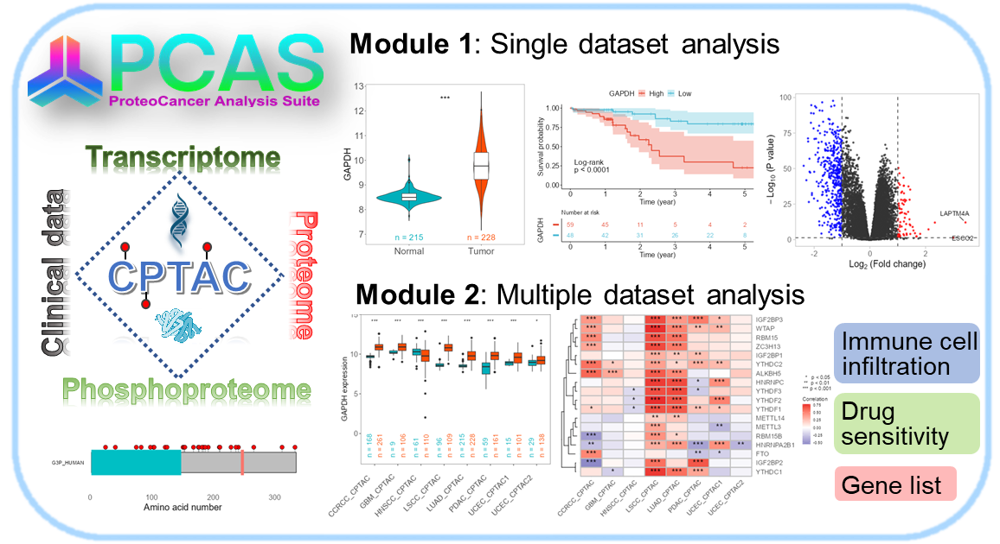

Users can directly access PCAS Shinyapp using the following link:< https://jingle.shinyapps.io/PCAS/ >

You can also install the R package:

```R
remotes::install_github("WangJin93/PCAS")
```
Enter the PCAS \ _ app() function to run the PCAS app, which can be used according to the article (link) of this tool:



The main functions of the PCAS package are:

1. **get\_data()：**

**Description**

Get the CPTAC data by using the api. All results saved in MySQL database.

**Usage**
```R
get_data(

  table = "LUAD_Academia_protein",

  action = "expression",

  genes = c("GAPDH", "TNS1")

)
```
**Arguments**

|table|For action = expression, use dataset$Abbre to get all tables; For action = clinic, remove \_protein/\_mRNA/\_Phospho from dataset$Abbre.|
| :- | :- |
|action|"expression", "degs" or "clinic".|
|gene|Gene symbols, you can input one or multiple symbols.|
1. **get\_expr\_data()**

**Description**

Get the mRNA/protein expression data in CPTAC database.

**Usage**
```R
get_expr_data(

  datasets = c("LUAD_CPTAC_protein", "LSCC_CPTAC_protein"),

  genes = c("TP53", "TNS1")

)

```
**Arguments**

|datasets|Dataset names, you can input one or multiple datasets. Use 'dataset$Abbre' to get all datasets.|
| :- | :- |
|genes|Gene symbols, you can input one or multiple symbols.|

1. **Get\_DEGs\_result()**

**Description**

Get the results of different expression analysis between tumor and normal samples in CPTAC datasets.

**Usage**
```R
get_DEGs_result(dataset = "LUAD_CPTAC_protein", method = "t.test")

```
**Arguments**

|dataset|Use dataset$Abbre to get all tables.|
| :- | :- |
|method|"limma" or "t.test".|

1. **merge\_clinic\_data()**

**Description**

Get clinic data and merge it with expression data.

**Usage**
```R
merge_clinic_data(cohort = "LUAD_APOLLO", data_input)

```
**Arguments**

|cohort|Data cohort, for example, "LUAD\_APOLLO", "LUAD\_CPTAC".|
| :- | :- |
|data\_input|Expression data obtained from get\_expr\_data() function.|

1. **cor\_cancer\_genelist()**

**Description**

Perform correlation analysis of the mRNA/protein expression data in CPTAC database.

**Usage**
```R
cor_cancer_genelist(

  dataset1 = "LUAD_CPTAC_protein",

  id1 = "STAT3",

  dataset2 = "LUAD_CPTAC_mRNA",

  id2 = c("TNS1", "TP53"),

  sample_type = c("Tumor", "Normal"),

  cor_method = "pearson"

)

```
**Arguments**

|dataset1|Dataset name. Use 'dataset$Abbre' to get all datasets.|
| :- | :- |
|id1|Gene symbol, you can input one gene symbols.|
|dataset2|Dataset name. Use 'dataset$Abbre' to get all datasets.|
|id2|Gene symbols, you can input one or multiple symbols.|
|sample\_type|Sample type used for correlation analysis, default all types: c("Tumor", "Normal").|
|cor\_method|cor\_method for correlation analysis, default "pearson".|

1. **cor\_pancancer\_genelist()**

**Description**

Perform correlation analysis of the mRNA/protein expression data in CPTAC database.

**Usage**
```R
cor_pancancer_genelist(

  df,

  geneset_data,

  sample_type = c("Tumor", "Normal"),

  cor_method = "pearson"

)

```
**Arguments**

|df|The expression data of the target gene in multiple datasets, obtained by the get\_expr\_data() function.|
| :- | :- |
|geneset\_data|The expression data of a genelist in multiple datasets, obtained by the get\_expr\_data() function.|
|sample\_type|Sample type used for correlation analysis, default all types: c("Tumor", "Normal").|
|cor\_method|Method for correlation analysis, default "pearson".|

1. **cor\_pancancer\_drug()**

**Description**

Calculate the correlation between target gene expression and anti-tumor drug sensitivity in multiple datasets.

**Usage**
```R
cor_pancancer_drug(

  df,

  cor_method = "pearson",

  Target.pathway = c("Cell cycle")

)

```
**Arguments**

|df|The expression data of the target gene in multiple datasets, obtained by the get\_expr\_data() function.|
| :- | :- |
|cor\_method|Method for correlation analysis, default "pearson".|
|Target.pathway|The signaling pathways of anti-tumor drug targets, default "Cell cycle". Use "drug\_info"to get the detail infomation of these drugs.|

1. **cor\_pancancer\_TIL**

**Description**

Calculate the correlation between target gene expression and immune cells infiltration in multiple datasets.

**Usage**
```R
cor_pancancer_TIL(df, cor_method = "spearman", TIL_type = c("TIMER"))

```
**Arguments**

|df|The expression data of the target gene in multiple datasets, obtained by the get\_expr\_data() function.|
| :- | :- |
|cor\_method|Method for correlation analysis, default "pearson".|
|TIL\_type|Algorithm for calculating immune cell infiltration, default "TIMER".|

1. **viz\_TvsN()**
### **Description**
Visualizing the different expression of mRNA/protein expression data between Tumor and Normal tissues in CPTAC database.
### **Usage**
```R
viz_TvsN(

  df,

  df_type = c("single", "multi_gene", "multi_set"),

  Show.P.value = TRUE,

  Show.P.label = TRUE,

  Method = "t.test",

  values = c("#00AFBB", "#FC4E07"),

  Show.n = TRUE,

  Show.n.location = "default"

)
```
1. **viz\_DEGs\_volcano()**

**Description**

Plotting volcano plot for DEGs between tumor and normal samples in CPTAC datasets.

**Usage**
```R
viz_DEGs_volcano(

  df,

  p.cut = 0.05,

  logFC.cut = 1,

  show.top = FALSE,

  show.labels = NULL

)

```
**Arguments**

|cohort|Data cohort, for example, "LUAD\_APOLLO", "LUAD\_CPTAC".|
| :- | :- |
|data\_input|Expression data obtained from get\_expr\_data() function.|

1. **viz\_cor\_heatmap()**

**Description**

Presenting correlation analysis results using heat maps based on ggplot2.

**Usage**
```R
viz_cor_heatmap(r, p)

```
**Arguments**

|r|The correlation coefficient matrix r of the correlation analysis results obtained from the functions cor\_pancancer\_genelist(), cor\_pancancer\_TIL(), and cor\_pancancer\_drug().|
| :- | :- |
|p|The P-value matrix p of the correlation analysis results obtained from the functions cor\_pancancer\_genelist(), cor\_pancancer\_TIL(), and cor\_pancancer\_drug().|

1. **viz\_corplot()**

**Description**

Scatter plot with sample size (n), correlation coefficient (r) and p value (p.value).

**Usage**
```R
viz_corplot(

  data,

  a,

  b,

  method = "pearson",

  x_lab = " relative expression",

  y_lab = " relative expression"

)

```
**Arguments**

|data|A gene expression dataset with at least two genes included, rows represent samples, and columns represent gene expression in the matrix.|
| :- | :- |
|a|Gene A|
|b|Gene B|
|method|Method for correlation analysis, "pearson" or "spearman".|
|x\_lab|X-axis label.|
|y\_lab|Y-axis label.|

1. **viz\_phoso\_sites()**

**Description**

Query phosphorylation site information of target proteins based on CPTAC database phosphorylation proteomics data or UniProt database.

**Usage**
```R
viz_phoso_sites(gene = "YTHDC2", phoso_infoDB = "CPTAC")

```
**Arguments**

|gene|Gene/protein symbol.|
| :- | :- |
|phoso\_infoDB|Database for extracting phosphorylation site information. only supports 'UniProt' and 'CPTAC', Default "CPTAC".|


